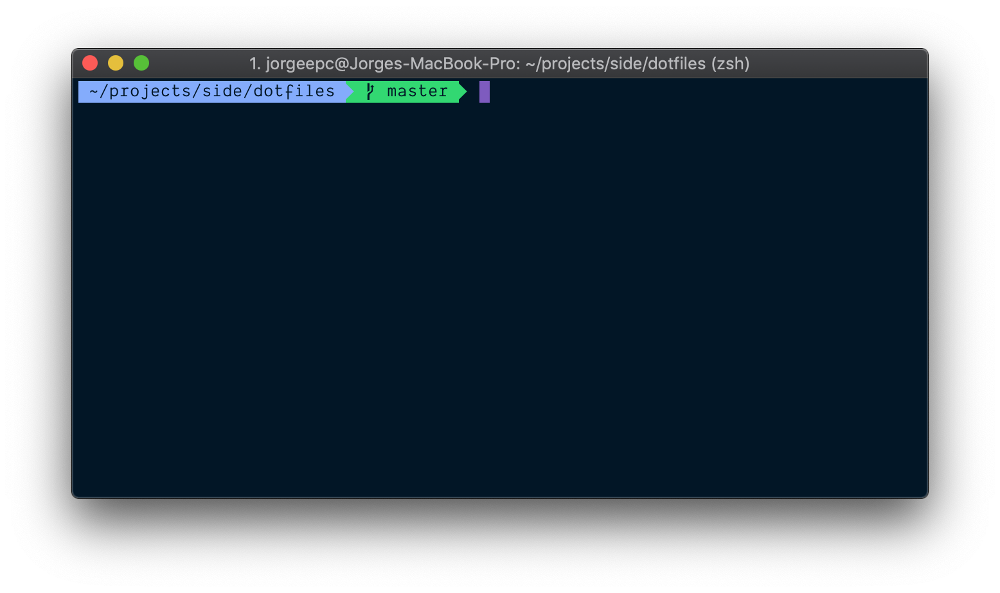

<div align="center">

[](https://iterm2.com/)

# iterm2

</div>

## colors

I use the [Night Owl for iTerm2](https://github.com/nickcernis/iterm2-night-owl) colors preset.

## fonts

I use [Dank Mono](https://dank.sh/) as my regular font, and [Inconsolata for Powerline](https://github.com/powerline/fonts) as my Non-ASCII font.

To install Powerline fonts:

```sh
# clone
git clone https://github.com/powerline/fonts.git --depth=1
# install
cd fonts
./install.sh
# clean-up a bit
cd ..
rm -rf fonts
```
