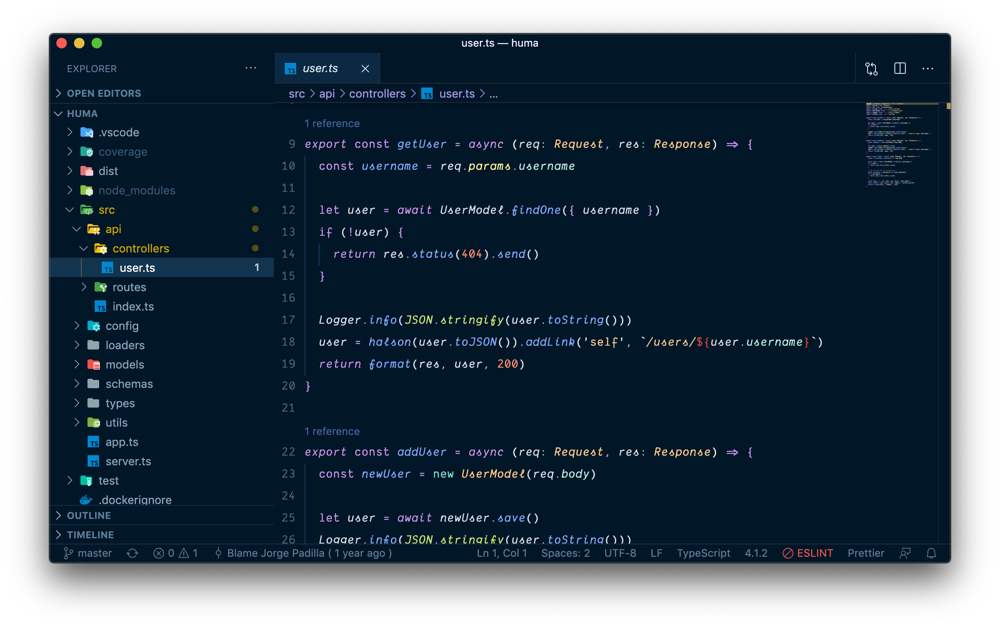

# vscode

## extensions

- [Babel JavaScript](https://marketplace.visualstudio.com/items?itemName=mgmcdermott.vscode-language-babel)
- [ESLint](https://marketplace.visualstudio.com/items?itemName=dbaeumer.vscode-eslint)
- [Git Blame](https://marketplace.visualstudio.com/items?itemName=waderyan.gitblame)
- [Material Icon Theme](https://marketplace.visualstudio.com/items?itemName=PKief.material-icon-theme)
- [Night Owl](https://marketplace.visualstudio.com/items?itemName=sdras.night-owl)
- [Prettier - Code formatter](https://marketplace.visualstudio.com/items?itemName=esbenp.prettier-vscode)
